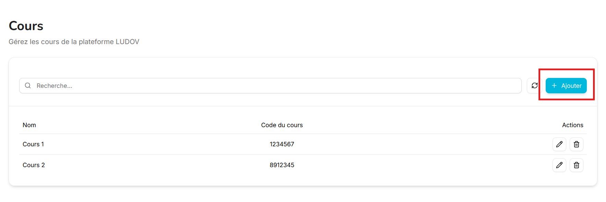
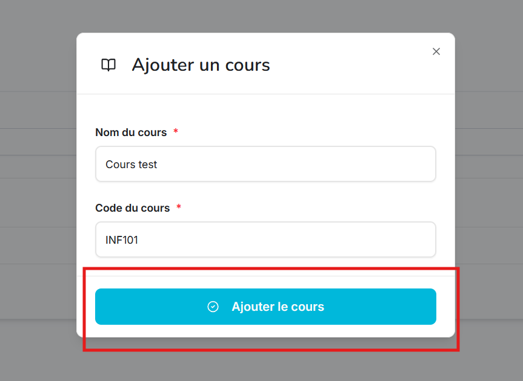
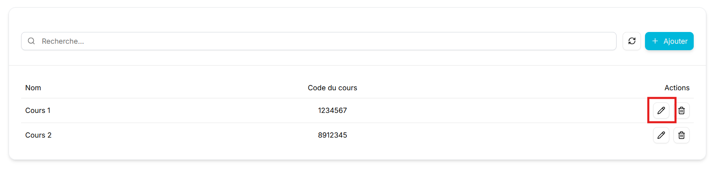
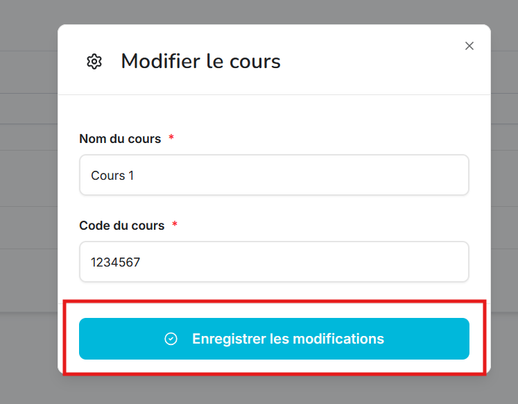
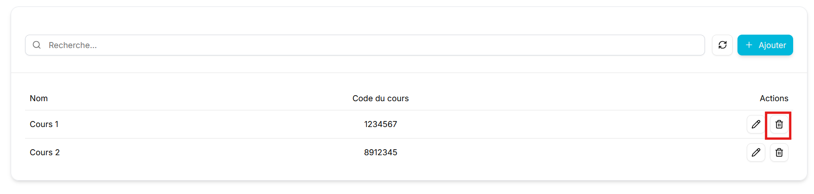
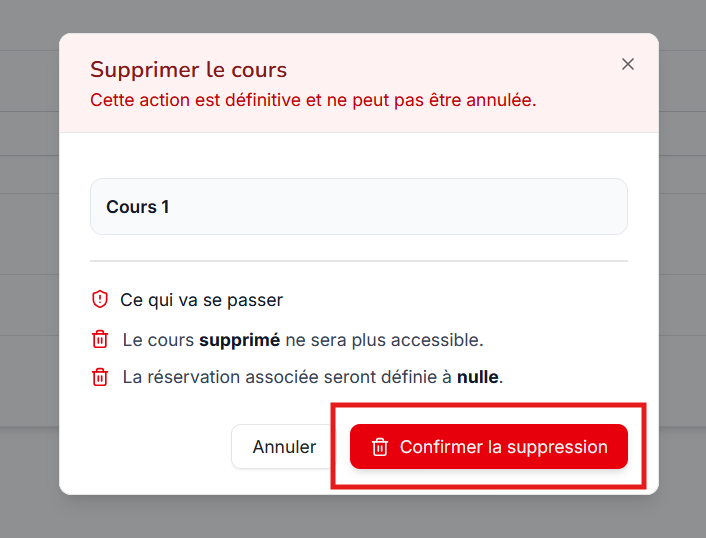
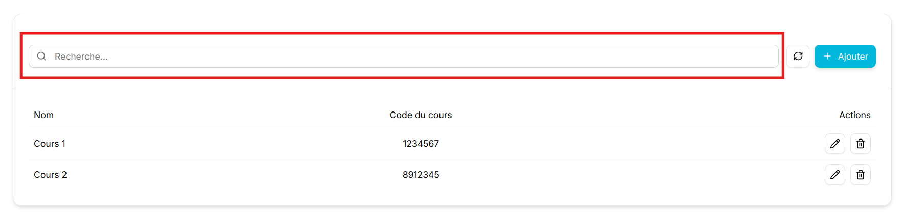
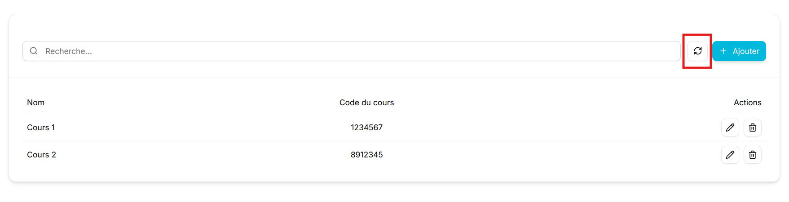

# Guide Complet : Gestion des Cours dans le Panneau d'Administration

## Table des matières
1. [Introduction](#introduction)
2. [Accès au panneau d'administration des cours](#accès-au-panneau-dadministration-des-cours)
3. [Tableau des utilisateurs](#tableau-des-cours)
4. [Ajouter un nouveau cours](#ajouter-un-nouveau-cours)
5. [Modifier un cours](#modifier-un-cours)
6. [Supprimer un cours](#supprimer-un-cours)
7. [Filtrage de cours](#filtrage-de-cours)
8. [Rafraîchissement](#rafraîchissement)

---

## Introduction

### À propos de ce guide

Ce guide détaillé vous accompagne dans toutes les étapes de la gestion des cours via le panneau d'administration.

---

## Accès au panneau d'administration des cours
1. Accédez à la page d'administration
2. Cliquez sur l'onglet *Cours*

## Tableau des cours
Le tableau des cours affiche tous les cours du module de réservation du LUDOV. Chaque ligne du tableau représente un cours avec les colonnes suivantes :
   - **Nom** : Nom du cours
   - **Code du cours** : Code du cours
   - **Actions** : Boutons permettant de modifier ou de supprimer un cours

## Ajouter un nouveeau cours
Le bouton **Ajouter** ouvre un dialogue permettant l'ajout d'un cours

### Comment ajouter un cours
1. Cliquez sur le bouton **Ajouter**.

2. Remplissez tous les champs, soit le nom et le code

4. Finalement, cliquez sur **Ajouter le cours** pour confirmer l'ajout

## Modifier un cours
En cliquant sur le bouton avec l'**icône de crayon**, vous pouvez modifier un cours, soit changer son nom et son code.

### Comment modifier un cours
1. Cliquez sur le bouton avec l'**icône de crayon**

2. Effectuez les changements nécessaires

3. Cliquez sur **Enregistrer le modifications** pour confirmer

## Supprimer un cours
En cliquant sur le bouton avec l'**icône de poubelle**, vous pouvez supprimer un cours.

### Comment supprimer un cours
1. Cliquez sur le bouton avec l'**icône de poubelle**

2. Prenez connaissance des avertissements dans le dialogue de confirmation

3. Clique sur **Confirmer la supression** pour supprimer le cours

## Filtrage de cours
Vous pouvez utiliser la barre de recherche pour filtrer la liste de cours

## Rafraîchissement
Appuyez sur le bouton de rafraîchissement pour mettre à jour la liste des cours manuellement
